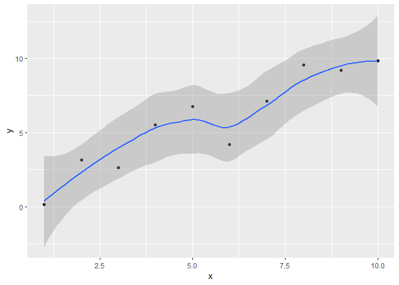

OOP-R-Hands-on
================
S.Ravichandran
April 27, 2019

<style type="text/css">

body, td {
   font-size: 14px;
}
code.r{
  font-size: 20px;
}
pre {
  font-size: 20px
}
</style>
### Preliminary information: Important object types in R

Let us create a logical object, x.

``` r
(x <- TRUE) # logical
```

    ## [1] TRUE

``` r
print(class(x))
```

    ## [1] "logical"

Let us create a list, also called x.

``` r
( x <- list(nums = 1:10, 
          chars = c("one","two","three"),
          ints = c(1L,2L,3L)
          ))
```

    ## $nums
    ##  [1]  1  2  3  4  5  6  7  8  9 10
    ## 
    ## $chars
    ## [1] "one"   "two"   "three"
    ## 
    ## $ints
    ## [1] 1 2 3

``` r
print(class(x))
```

    ## [1] "list"

BMI is a data.frame with four variables, Gender, Height, Weight and Age.

``` r
(BMI <-     data.frame(
   Gender = c("Male", "Male","Female"), 
   Height = c(153.1, 173.6, 165.0), 
   Weight = c(81,93, 78),
      Age = c(42,38,26)
))
```

    ##   Gender Height Weight Age
    ## 1   Male  153.1     81  42
    ## 2   Male  173.6     93  38
    ## 3 Female  165.0     78  26

``` r
print(class(BMI))
```

    ## [1] "data.frame"

### Hands-on 1

    ## 
    ## Attaching package: 'dplyr'

    ## The following objects are masked from 'package:stats':
    ## 
    ##     filter, lag

    ## The following objects are masked from 'package:base':
    ## 
    ##     intersect, setdiff, setequal, union

    ## 
    ## Attaching package: 'sloop'

    ## The following objects are masked from 'package:pryr':
    ## 
    ##     ftype, is_s3_generic, is_s3_method, otype

One of the important concept of OOP is functions can respond in different ways depending on the input object type. To explain this concept, let us create the following objects: \* numeric vector of 10 random numbers \* categorical vector of length 6 \* a linear model object

First, let us create a numerical vector with 10 elements.

``` r
( x_num <- rnorm(10) )
```

    ##  [1]  1.11574 -1.60747 -1.61685  1.61819  0.56791  0.28399  0.03843
    ##  [8]  1.61657  1.15572  0.81607

Next, we build a categorical vector with 6 elements.

``` r
( x_fac <- factor(c("A", "B", "A", "C", "A", "B")) )
```

    ## [1] A B A C A B
    ## Levels: A B C

Finally, a linear model variable.

``` r
# setting seed

set.seed(123)
(x <- 1:10)
```

    ##  [1]  1  2  3  4  5  6  7  8  9 10

``` r
(y <- jitter(x, amount = 2))
```

    ##  [1] 0.1503 3.1532 2.6359 5.5321 6.7619 4.1822 7.1124 9.5697 9.2057 9.8265

``` r
#build a model
(model <- lm(y ~ x))
```

    ## 
    ## Call:
    ## lm(formula = y ~ x)
    ## 
    ## Coefficients:
    ## (Intercept)            x  
    ##        0.27         1.01

``` r
data.frame(x, y) %>% ggplot(aes(x, y)) + 
  geom_point() + 
  geom_smooth()
```

    ## `geom_smooth()` using method = 'loess' and formula 'y ~ x'



### Call summary function on the different class of objects

``` r
x_num
```

    ##  [1]  1.11574 -1.60747 -1.61685  1.61819  0.56791  0.28399  0.03843
    ##  [8]  1.61657  1.15572  0.81607

``` r
summary(x_num)
```

    ##    Min. 1st Qu.  Median    Mean 3rd Qu.    Max. 
    ## -1.6169  0.0998  0.6920  0.3988  1.1457  1.6182

``` r
x_fac
```

    ## [1] A B A C A B
    ## Levels: A B C

``` r
summary(x_fac)
```

    ## A B C 
    ## 3 2 1

``` r
model
```

    ## 
    ## Call:
    ## lm(formula = y ~ x)
    ## 
    ## Coefficients:
    ## (Intercept)            x  
    ##        0.27         1.01

``` r
summary(model)
```

    ## 
    ## Call:
    ## lm(formula = y ~ x)
    ## 
    ## Residuals:
    ##    Min     1Q Median     3Q    Max 
    ## -2.135 -0.624 -0.173  1.140  1.453 
    ## 
    ## Coefficients:
    ##             Estimate Std. Error t value Pr(>|t|)    
    ## (Intercept)    0.270      0.854    0.32     0.76    
    ## x              1.008      0.138    7.32  8.2e-05 ***
    ## ---
    ## Signif. codes:  0 '***' 0.001 '**' 0.01 '*' 0.05 '.' 0.1 ' ' 1
    ## 
    ## Residual standard error: 1.25 on 8 degrees of freedom
    ## Multiple R-squared:  0.87,   Adjusted R-squared:  0.854 
    ## F-statistic: 53.6 on 1 and 8 DF,  p-value: 8.22e-05

### How does R distinguish types of variables? what command(s) can be used for this task?

``` r
# matrix 
(int_mat <- matrix(1:12, nrow=4, ncol=3 )) # column major
```

    ##      [,1] [,2] [,3]
    ## [1,]    1    5    9
    ## [2,]    2    6   10
    ## [3,]    3    7   11
    ## [4,]    4    8   12

``` r
# determine the variable
class(int_mat) # obj is a matrix
```

    ## [1] "matrix"

``` r
# what type of matrix (elements are of what type)
typeof(int_mat) # int matrix; content of the matrix
```

    ## [1] "integer"

``` r
(float_mat <- matrix(rnorm(12), nrow=4, ncol=3))
```

    ##         [,1]    [,2]    [,3]
    ## [1,]  1.7151 -0.4457  0.1107
    ## [2,]  0.4609  1.2241 -0.5558
    ## [3,] -1.2651  0.3598  1.7869
    ## [4,] -0.6869  0.4008  0.4979

``` r
class(float_mat) # matrix
```

    ## [1] "matrix"

``` r
typeof(float_mat) # double; type of var that makes up matrix
```

    ## [1] "double"

``` r
# c code; in C floating point #s are double
```

### Hands-on 2: How does R distinguish types of var?

Introduction to S3-systems.

Interrogation of objects to see whether they are S3 objects.

``` r
int_mat
```

    ##      [,1] [,2] [,3]
    ## [1,]    1    5    9
    ## [2,]    2    6   10
    ## [3,]    3    7   11
    ## [4,]    4    8   12

``` r
sloop::otype(int_mat) # package::command(object)
```

    ## [1] "base"

``` r
mtcars
```

    ##                      mpg cyl  disp  hp drat    wt  qsec vs am gear carb
    ## Mazda RX4           21.0   6 160.0 110 3.90 2.620 16.46  0  1    4    4
    ## Mazda RX4 Wag       21.0   6 160.0 110 3.90 2.875 17.02  0  1    4    4
    ## Datsun 710          22.8   4 108.0  93 3.85 2.320 18.61  1  1    4    1
    ## Hornet 4 Drive      21.4   6 258.0 110 3.08 3.215 19.44  1  0    3    1
    ## Hornet Sportabout   18.7   8 360.0 175 3.15 3.440 17.02  0  0    3    2
    ## Valiant             18.1   6 225.0 105 2.76 3.460 20.22  1  0    3    1
    ## Duster 360          14.3   8 360.0 245 3.21 3.570 15.84  0  0    3    4
    ## Merc 240D           24.4   4 146.7  62 3.69 3.190 20.00  1  0    4    2
    ## Merc 230            22.8   4 140.8  95 3.92 3.150 22.90  1  0    4    2
    ## Merc 280            19.2   6 167.6 123 3.92 3.440 18.30  1  0    4    4
    ## Merc 280C           17.8   6 167.6 123 3.92 3.440 18.90  1  0    4    4
    ## Merc 450SE          16.4   8 275.8 180 3.07 4.070 17.40  0  0    3    3
    ## Merc 450SL          17.3   8 275.8 180 3.07 3.730 17.60  0  0    3    3
    ## Merc 450SLC         15.2   8 275.8 180 3.07 3.780 18.00  0  0    3    3
    ## Cadillac Fleetwood  10.4   8 472.0 205 2.93 5.250 17.98  0  0    3    4
    ## Lincoln Continental 10.4   8 460.0 215 3.00 5.424 17.82  0  0    3    4
    ## Chrysler Imperial   14.7   8 440.0 230 3.23 5.345 17.42  0  0    3    4
    ## Fiat 128            32.4   4  78.7  66 4.08 2.200 19.47  1  1    4    1
    ## Honda Civic         30.4   4  75.7  52 4.93 1.615 18.52  1  1    4    2
    ## Toyota Corolla      33.9   4  71.1  65 4.22 1.835 19.90  1  1    4    1
    ## Toyota Corona       21.5   4 120.1  97 3.70 2.465 20.01  1  0    3    1
    ## Dodge Challenger    15.5   8 318.0 150 2.76 3.520 16.87  0  0    3    2
    ## AMC Javelin         15.2   8 304.0 150 3.15 3.435 17.30  0  0    3    2
    ## Camaro Z28          13.3   8 350.0 245 3.73 3.840 15.41  0  0    3    4
    ## Pontiac Firebird    19.2   8 400.0 175 3.08 3.845 17.05  0  0    3    2
    ## Fiat X1-9           27.3   4  79.0  66 4.08 1.935 18.90  1  1    4    1
    ## Porsche 914-2       26.0   4 120.3  91 4.43 2.140 16.70  0  1    5    2
    ## Lotus Europa        30.4   4  95.1 113 3.77 1.513 16.90  1  1    5    2
    ## Ford Pantera L      15.8   8 351.0 264 4.22 3.170 14.50  0  1    5    4
    ## Ferrari Dino        19.7   6 145.0 175 3.62 2.770 15.50  0  1    5    6
    ## Maserati Bora       15.0   8 301.0 335 3.54 3.570 14.60  0  1    5    8
    ## Volvo 142E          21.4   4 121.0 109 4.11 2.780 18.60  1  1    4    2

``` r
sloop::otype(mtcars)
```

    ## [1] "S3"

### S3 & R6: how to assign classes?

-   Can I override the class? Yes
-   And as expected, it wont break the functionality
-   Can I woverride the type? No

``` r
x_num
```

    ##  [1]  1.11574 -1.60747 -1.61685  1.61819  0.56791  0.28399  0.03843
    ##  [8]  1.61657  1.15572  0.81607

``` r
class(x_num)
```

    ## [1] "numeric"

``` r
typeof(x_num)
```

    ## [1] "double"

``` r
class(x_num) <- "random-numbers"
class(x_num)
```

    ## [1] "random-numbers"

``` r
# the class that we have added has become an attribute
x_num
```

    ##  [1]  1.11574 -1.60747 -1.61685  1.61819  0.56791  0.28399  0.03843
    ##  [8]  1.61657  1.15572  0.81607
    ## attr(,"class")
    ## [1] "random-numbers"

``` r
# we cannot override typeof 
typeof(x_num)
```

    ## [1] "double"

``` r
is.numeric(x_num) # no matter what the class says
```

    ## [1] TRUE

### S3 & R6: Function overloading

S3 exists so that we dont have to write many many functions to take care of different data types.

How does it work?

-   S3 splits a function into generic and method functions.
-   Methods named generic.class (Ex. print.Date)

Example of generic functions are print, summary etc.

``` r
string <- "Hello World!"
print(string)
```

    ## [1] "Hello World!"

``` r
# Let us look at the function
print
```

    ## function (x, ...) 
    ## UseMethod("print")
    ## <bytecode: 0x00000000189bf6b8>
    ## <environment: namespace:base>

``` r
x_Date <- Sys.Date() # "2019-03-26"
class(x_Date) # "Date"
```

    ## [1] "Date"

``` r
print(x_Date) # "2019-03-26"
```

    ## [1] "2019-04-30"

``` r
print.Date(x_Date) # "2019-03-26"
```

    ## [1] "2019-04-30"

### How do we know what (if, any) methods exist for a generic function?

-   For example, for the generic function what methods are available
-   generic.class1, generic.class2, generic.class3

Exmaple. print (generic), print.data.frame, print.Date etc.

``` r
methods(print) # too many methods 
```

    ##   [1] print.acf*                                        
    ##   [2] print.AES*                                        
    ##   [3] print.all_vars*                                   
    ##   [4] print.anova*                                      
    ##   [5] print.any_vars*                                   
    ##   [6] print.aov*                                        
    ##   [7] print.aovlist*                                    
    ##   [8] print.ar*                                         
    ##   [9] print.Arima*                                      
    ##  [10] print.arima0*                                     
    ##  [11] print.AsIs                                        
    ##  [12] print.aspell*                                     
    ##  [13] print.aspell_inspect_context*                     
    ##  [14] print.bibentry*                                   
    ##  [15] print.Bibtex*                                     
    ##  [16] print.BoolResult*                                 
    ##  [17] print.browseVignettes*                            
    ##  [18] print.by                                          
    ##  [19] print.bytes*                                      
    ##  [20] print.changedFiles*                               
    ##  [21] print.check_code_usage_in_package*                
    ##  [22] print.check_compiled_code*                        
    ##  [23] print.check_demo_index*                           
    ##  [24] print.check_depdef*                               
    ##  [25] print.check_details*                              
    ##  [26] print.check_details_changes*                      
    ##  [27] print.check_doi_db*                               
    ##  [28] print.check_dotInternal*                          
    ##  [29] print.check_make_vars*                            
    ##  [30] print.check_nonAPI_calls*                         
    ##  [31] print.check_package_code_assign_to_globalenv*     
    ##  [32] print.check_package_code_attach*                  
    ##  [33] print.check_package_code_data_into_globalenv*     
    ##  [34] print.check_package_code_startup_functions*       
    ##  [35] print.check_package_code_syntax*                  
    ##  [36] print.check_package_code_unload_functions*        
    ##  [37] print.check_package_compact_datasets*             
    ##  [38] print.check_package_CRAN_incoming*                
    ##  [39] print.check_package_datasets*                     
    ##  [40] print.check_package_depends*                      
    ##  [41] print.check_package_description*                  
    ##  [42] print.check_package_description_encoding*         
    ##  [43] print.check_package_license*                      
    ##  [44] print.check_packages_in_dir*                      
    ##  [45] print.check_packages_used*                        
    ##  [46] print.check_po_files*                             
    ##  [47] print.check_pragmas*                              
    ##  [48] print.check_Rd_contents*                          
    ##  [49] print.check_Rd_line_widths*                       
    ##  [50] print.check_Rd_metadata*                          
    ##  [51] print.check_Rd_xrefs*                             
    ##  [52] print.check_RegSym_calls*                         
    ##  [53] print.check_so_symbols*                           
    ##  [54] print.check_T_and_F*                              
    ##  [55] print.check_url_db*                               
    ##  [56] print.check_vignette_index*                       
    ##  [57] print.checkDocFiles*                              
    ##  [58] print.checkDocStyle*                              
    ##  [59] print.checkFF*                                    
    ##  [60] print.checkRd*                                    
    ##  [61] print.checkReplaceFuns*                           
    ##  [62] print.checkS3methods*                             
    ##  [63] print.checkTnF*                                   
    ##  [64] print.checkVignettes*                             
    ##  [65] print.citation*                                   
    ##  [66] print.codoc*                                      
    ##  [67] print.codocClasses*                               
    ##  [68] print.codocData*                                  
    ##  [69] print.colonnade*                                  
    ##  [70] print.colorConverter*                             
    ##  [71] print.compactPDF*                                 
    ##  [72] print.condition                                   
    ##  [73] print.connection                                  
    ##  [74] print.CRAN_package_reverse_dependencies_and_views*
    ##  [75] print.crayon*                                     
    ##  [76] print.data.frame                                  
    ##  [77] print.Date                                        
    ##  [78] print.default                                     
    ##  [79] print.dendrogram*                                 
    ##  [80] print.density*                                    
    ##  [81] print.difftime                                    
    ##  [82] print.dist*                                       
    ##  [83] print.Dlist                                       
    ##  [84] print.DLLInfo                                     
    ##  [85] print.DLLInfoList                                 
    ##  [86] print.DLLRegisteredRoutines                       
    ##  [87] print.dplyr_sel_vars*                             
    ##  [88] print.dummy_coef*                                 
    ##  [89] print.dummy_coef_list*                            
    ##  [90] print.ecdf*                                       
    ##  [91] print.eigen                                       
    ##  [92] print.element*                                    
    ##  [93] print.envlist*                                    
    ##  [94] print.factanal*                                   
    ##  [95] print.factor                                      
    ##  [96] print.family*                                     
    ##  [97] print.fileSnapshot*                               
    ##  [98] print.findLineNumResult*                          
    ##  [99] print.flatGridListing*                            
    ## [100] print.formula*                                    
    ## [101] print.frame*                                      
    ## [102] print.fseq*                                       
    ## [103] print.ftable*                                     
    ## [104] print.fun_list*                                   
    ## [105] print.function                                    
    ## [106] print.getAnywhere*                                
    ## [107] print.ggplot*                                     
    ## [108] print.ggplot2_bins*                               
    ## [109] print.ggproto*                                    
    ## [110] print.ggproto_method*                             
    ## [111] print.gList*                                      
    ## [112] print.glm*                                        
    ## [113] print.glue*                                       
    ## [114] print.gpar*                                       
    ## [115] print.grob*                                       
    ## [116] print.gtable*                                     
    ## [117] print.hcl_palettes*                               
    ## [118] print.hclust*                                     
    ## [119] print.help_files_with_topic*                      
    ## [120] print.hexmode                                     
    ## [121] print.HoltWinters*                                
    ## [122] print.hsearch*                                    
    ## [123] print.hsearch_db*                                 
    ## [124] print.htest*                                      
    ## [125] print.html*                                       
    ## [126] print.html_dependency*                            
    ## [127] print.hybrid_call*                                
    ## [128] print.indexed*                                    
    ## [129] print.infl*                                       
    ## [130] print.inspect*                                    
    ## [131] print.inspect_NILSXP*                             
    ## [132] print.integrate*                                  
    ## [133] print.isoreg*                                     
    ## [134] print.kmeans*                                     
    ## [135] print.knitr_kable*                                
    ## [136] print.Latex*                                      
    ## [137] print.LaTeX*                                      
    ## [138] print.lazy*                                       
    ## [139] print.libraryIQR                                  
    ## [140] print.listof                                      
    ## [141] print.lm*                                         
    ## [142] print.loadings*                                   
    ## [143] print.location*                                   
    ## [144] print.loess*                                      
    ## [145] print.logLik*                                     
    ## [146] print.ls_str*                                     
    ## [147] print.medpolish*                                  
    ## [148] print.method_table*                               
    ## [149] print.MethodsFunction*                            
    ## [150] print.mtable*                                     
    ## [151] print.NativeRoutineList                           
    ## [152] print.news_db*                                    
    ## [153] print.nls*                                        
    ## [154] print.noquote                                     
    ## [155] print.numeric_version                             
    ## [156] print.object_size*                                
    ## [157] print.octmode                                     
    ## [158] print.packageDescription*                         
    ## [159] print.packageInfo                                 
    ## [160] print.packageIQR*                                 
    ## [161] print.packageStatus*                              
    ## [162] print.pairwise.htest*                             
    ## [163] print.path*                                       
    ## [164] print.PDF_Array*                                  
    ## [165] print.PDF_Dictionary*                             
    ## [166] print.pdf_doc*                                    
    ## [167] print.pdf_fonts*                                  
    ## [168] print.PDF_Indirect_Reference*                     
    ## [169] print.pdf_info*                                   
    ## [170] print.PDF_Keyword*                                
    ## [171] print.PDF_Name*                                   
    ## [172] print.PDF_Stream*                                 
    ## [173] print.PDF_String*                                 
    ## [174] print.person*                                     
    ## [175] print.pillar*                                     
    ## [176] print.pillar_ornament*                            
    ## [177] print.pillar_shaft*                               
    ## [178] print.pillar_vertical*                            
    ## [179] print.POSIXct                                     
    ## [180] print.POSIXlt                                     
    ## [181] print.power.htest*                                
    ## [182] print.ppr*                                        
    ## [183] print.prcomp*                                     
    ## [184] print.princomp*                                   
    ## [185] print.proc_time                                   
    ## [186] print.purrr_function_compose*                     
    ## [187] print.purrr_function_partial*                     
    ## [188] print.purrr_rate_backoff*                         
    ## [189] print.purrr_rate_delay*                           
    ## [190] print.quosure*                                    
    ## [191] print.quosures*                                   
    ## [192] print.quoted*                                     
    ## [193] print.R6*                                         
    ## [194] print.R6ClassGenerator*                           
    ## [195] print.raster*                                     
    ## [196] print.Rcpp_stack_trace*                           
    ## [197] print.Rd*                                         
    ## [198] print.recordedplot*                               
    ## [199] print.rel*                                        
    ## [200] print.restart                                     
    ## [201] print.RGBcolorConverter*                          
    ## [202] print.rif_shaft*                                  
    ## [203] print.rlang_box_done*                             
    ## [204] print.rlang_data_pronoun*                         
    ## [205] print.rlang_envs*                                 
    ## [206] print.rlang_error*                                
    ## [207] print.rlang_fake_data_pronoun*                    
    ## [208] print.rlang_lambda_function*                      
    ## [209] print.rlang_trace*                                
    ## [210] print.rlang_zap*                                  
    ## [211] print.rle                                         
    ## [212] print.roman*                                      
    ## [213] print.rowwise_df*                                 
    ## [214] print.SavedPlots*                                 
    ## [215] print.sessionInfo*                                
    ## [216] print.shiny.tag*                                  
    ## [217] print.shiny.tag.list*                             
    ## [218] print.simple.list                                 
    ## [219] print.smooth.spline*                              
    ## [220] print.socket*                                     
    ## [221] print.spark*                                      
    ## [222] print.split*                                      
    ## [223] print.squeezed_colonnade*                         
    ## [224] print.src*                                        
    ## [225] print.srcfile                                     
    ## [226] print.srcref                                      
    ## [227] print.stepfun*                                    
    ## [228] print.stl*                                        
    ## [229] print.StructTS*                                   
    ## [230] print.subdir_tests*                               
    ## [231] print.summarize_CRAN_check_status*                
    ## [232] print.summary.aov*                                
    ## [233] print.summary.aovlist*                            
    ## [234] print.summary.ecdf*                               
    ## [235] print.summary.glm*                                
    ## [236] print.summary.lm*                                 
    ## [237] print.summary.loess*                              
    ## [238] print.summary.manova*                             
    ## [239] print.summary.nls*                                
    ## [240] print.summary.packageStatus*                      
    ## [241] print.summary.ppr*                                
    ## [242] print.summary.prcomp*                             
    ## [243] print.summary.princomp*                           
    ## [244] print.summary.table                               
    ## [245] print.summary.warnings                            
    ## [246] print.summaryDefault                              
    ## [247] print.table                                       
    ## [248] print.tables_aov*                                 
    ## [249] print.tbl*                                        
    ## [250] print.tbl_cube*                                   
    ## [251] print.terms*                                      
    ## [252] print.theme*                                      
    ## [253] print.trans*                                      
    ## [254] print.trunc_mat*                                  
    ## [255] print.ts*                                         
    ## [256] print.tskernel*                                   
    ## [257] print.TukeyHSD*                                   
    ## [258] print.tukeyline*                                  
    ## [259] print.tukeysmooth*                                
    ## [260] print.undoc*                                      
    ## [261] print.uneval*                                     
    ## [262] print.unit*                                       
    ## [263] print.viewport*                                   
    ## [264] print.vignette*                                   
    ## [265] print.warnings                                    
    ## [266] print.xfun_raw_string*                            
    ## [267] print.xfun_strict_list*                           
    ## [268] print.xgettext*                                   
    ## [269] print.xngettext*                                  
    ## [270] print.xtabs*                                      
    ## see '?methods' for accessing help and source code

### What methods are available for a given class of an object?

-   The methods could be coming from different generic classes. For example, generic1.class, generic2.class etc.
-   Note this methods call for this case will return both S3 and s4 objects.

``` r
methods(class="lm") # or methods(class=lm)
```

    ##  [1] add1           alias          anova          case.names    
    ##  [5] coerce         confint        cooks.distance deviance      
    ##  [9] dfbeta         dfbetas        drop1          dummy.coef    
    ## [13] effects        extractAIC     family         formula       
    ## [17] fortify        hatvalues      influence      initialize    
    ## [21] kappa          labels         logLik         model.frame   
    ## [25] model.matrix   nobs           plot           predict       
    ## [29] print          proj           qr             residuals     
    ## [33] rstandard      rstudent       show           simulate      
    ## [37] slotsFromS3    summary        variable.names vcov          
    ## see '?methods' for accessing help and source code

``` r
.S3methods(class="lm")
```

    ##  [1] add1           alias          anova          case.names    
    ##  [5] confint        cooks.distance deviance       dfbeta        
    ##  [9] dfbetas        drop1          dummy.coef     effects       
    ## [13] extractAIC     family         formula        fortify       
    ## [17] hatvalues      influence      kappa          labels        
    ## [21] logLik         model.frame    model.matrix   nobs          
    ## [25] plot           predict        print          proj          
    ## [29] qr             residuals      rstandard      rstudent      
    ## [33] simulate       summary        variable.names vcov          
    ## see '?methods' for accessing help and source code

As we saw, print function (just a simple 1 line function) &gt; print function (x, ...) UseMethod("print") &lt;bytecode: 0x000000000a237408&gt; \# memory, important, ignore for now &lt;environment: namespace:base&gt; \# environment, important, but ignore for now

print function calls UseMethod("print")

``` r
pryr::is_s3_generic("print") # TRUE
```

    ## [1] TRUE

``` r
pryr::is_s3_method("print") # FALSE
```

    ## [1] FALSE

``` r
pryr::is_s3_method("print.Date") # TRUE
```

    ## [1] TRUE

``` r
print
```

    ## function (x, ...) 
    ## UseMethod("print")
    ## <bytecode: 0x00000000189bf6b8>
    ## <environment: namespace:base>

``` r
( people <- c("Frank Blanchard",
            "Andrea Gnuschke",
            "Max Cole",
            "Maryellen Hackett",
            "Victoria Brun",
            "Jonathan Summers",
            "Christopher Worthington",
            "Samuel Lopez",
            "Richard Frederickson",
            "Chris Hu") )
```

    ##  [1] "Frank Blanchard"         "Andrea Gnuschke"        
    ##  [3] "Max Cole"                "Maryellen Hackett"      
    ##  [5] "Victoria Brun"           "Jonathan Summers"       
    ##  [7] "Christopher Worthington" "Samuel Lopez"           
    ##  [9] "Richard Frederickson"    "Chris Hu"

``` r
class(people)
```

    ## [1] "character"

``` r
( class(people) <- "InsiteGroup" )
```

    ## [1] "InsiteGroup"

``` r
# get the first name from the vector 
# create generic function 
GetFirst <- function(obj) { 
  UseMethod("GetFirst",obj) 
  }
class(GetFirst)
```

    ## [1] "function"

``` r
# create methods function 
GetFirst.InsiteGroup <- function(obj) { 
  return(obj[1])
}

# create default function 
GetFirst.default <- function(obj){
  cat("This is a generic class\n")
  # do something
  }

GetFirst(people)
```

    ## [1] "Frank Blanchard"

If no suitable methods can be found for a generic, then an error is thrown. For example, at the moment, get\_n\_elements() only has 2 methods available. If you pass a data.frame/matrix to get\_n\_elements() instead, you'll see an error. One could use generic.default to deal with all the missing class of objects.

### Can variables have more than one class?

``` r
human <- "laugh"

# less specific to more specific; final default class,character
class(human) <- c("mammalia","eukaryota","character")
class(human)
```

    ## [1] "mammalia"  "eukaryota" "character"

``` r
# create a generic method for who_am_i
who_am_i <- function(x, ...) {
  UseMethod("who_am_i")
}

# create mammalia method for who_am_i
who_am_i.mammalia <- function(x, ...) {
  # let us write a message 
  message("I am a Mammal")
  NextMethod("x")
}

# create eukarota method for who_am_i
who_am_i.eukaryota <- function(x, ...) {
  # let us write a message 
  message("I am a Eukaryote")
  NextMethod("x")
}

# finally one for character method
who_am_i.character <- function(x, ...) {
  # let us write a message 
  message("I am a simple character!")
  # since this is the last, no NextMethod
}

# call human to see all the 3 messages are displayed
class(human)
```

    ## [1] "mammalia"  "eukaryota" "character"

``` r
who_am_i(human) 
```

    ## I am a Mammal

    ## I am a Eukaryote

    ## I am a simple character!
